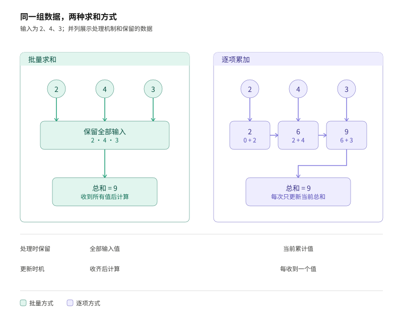

# Visualize

Visualize is an Agent Skill for generating clean technical diagrams as self-contained SVG files. It works with agents that support skills, including Cursor, Codex, Claude Code, and similar tools.

Use it when you want an architecture diagram, flowchart, sequence diagram, memory architecture, data flow, UML-style diagram, comparison matrix, timeline, or another technical visual from a plain-language prompt.


## How To Use

Describe the diagram you want in natural language:

```text
Draw a RAG pipeline diagram.
Draw a Mem0 memory architecture diagram and save it to ~/Desktop/.
Draw a microservice architecture diagram: Client -> API Gateway -> User Service / Order Service -> PostgreSQL + Redis.
```

The agent identifies the diagram type, opens the matching reference from `assets/gallery/<type>.svg`, and writes an SVG in the Visualize house style.

## What It Produces

Visualize writes SVG by default. The SVG is editable, scalable, and can be opened directly in a browser or embedded in documentation.

When Python 3.10+ is available, the skill uses the included `svgkit` helper to size boxes from their text, anchor arrows on box edges, and keep the SVG structure valid. If Python is not available, the agent can still write the SVG directly.

No dependencies are installed by this skill.

## Geometry and Visual Checks

Layout mistakes are the usual way a generated diagram goes wrong: text clipping its box, an arrow cutting through a node, two boxes overlapping, or an arrow label spilling into the box next to it. Visualize combines geometry validation with inspection of the rendered result when a browser is available.

`svgkit` writes and validates every file in the same `save()` call. A clean file—or one with warnings only—returns normally. A hard validation failure is machine-detectable: after writing the SVG and printing every problem's details and suggested fix, `save()` raises `svgkit.ValidationError`. The exception carries the complete structured results, and the invalid file remains on disk for inspection.

```text
[svgkit] diagram.svg: self-check found 1 error(s)
  [FAIL] Checking box overlap
         - rect [40,60,160,116] overlaps rect [120,80,240,136]
         Fix: Move overlapping nodes apart; only explicit panels may contain nodes.
```

The same validator runs standalone over any SVG, including several at once:

```bash
python3 visualize/scripts/validate_svg.py -q diagram.svg other.svg
python3 visualize/scripts/validate_svg.py --strict --json ./diagrams
```

`-q` / `--quiet` emits nothing when every file is clean. It prints only warnings and failures otherwise; warnings alone still exit 0, while any hard failure makes the multi-file command exit 1.

Directories are searched recursively; quoted globs are accepted and duplicate paths are checked once. `--strict` also fails on warnings. `--json` reports each file's findings and a batch summary. Missing files, empty directories, and unmatched patterns fail. See [validation coverage and limits](../visualize/references/validation.md).

Checks cover:

- **Structure** — UTF-8/XML well-formedness, `<svg>` root, usable viewBox
- **Accessibility** — non-empty `<title>` + `<desc>` as first element children
- **Assets & references** — self-contained (no external/relative URLs, no `xml-stylesheet` PIs); all local `#id` references resolve; IDs are unique
- **Markers** — exactly one `<marker id="arrow">`; every marker reference targets it
- **Background & style** — opaque white rect covers the viewBox; no gradients, filters, or shadows
- **Geometry** — shape overlap/containment; arrow-through-obstacle collisions; canvas overflow
- **Text** — text fit within boxes; free-label collisions with nodes and each other; type scale (14/12); baselines; warm palette
- **Closing** — file ends with `</svg>`

Geometry limits are deliberate and visible: transformed elements and `<text>` with nested `<tspan>` runs are skipped with explicit warnings rather than measured at fictitious coordinates. Curved arrows are sampled along real quadratic/cubic/arc trajectories. Hidden or fully transparent paint does not become an obstacle. `svgkit` emits non-visual `data-role` attributes to distinguish intentional structure from accidental overlap; hand-written SVG can use the same roles.

Browser inspection catches a different class of problem: actual fonts can collide even when estimated widths pass, and a later shape can hide a correctly routed arrow. Inspect labels, arrowheads, group headers, and the complete legend at the intended display size.

## Supported Diagram Types

| Type | Use it for |
|---|---|
| Architecture | Services, components, cloud infrastructure, layered systems |
| Data flow | Pipelines with labeled payloads and transformations |
| Flowchart | Decisions, branches, process loops |
| Agent architecture | LLM, tools, memory, planning, output layers |
| Memory architecture | Separate memory writes and query-driven reads |
| Sequence | Time-ordered requests and responses with lifelines |
| State machine | UML states, transitions, guards, initial and final states |
| Class diagram | UML-style classes with attributes, methods, and relationships |
| Use case | Actors, use cases, include and extend relationships |
| ER diagram | Entities, relationships, and cardinality labels |
| Network topology | Firewalls, switches, DMZs, internal and external zones |
| Comparison | Feature matrices and capability comparisons |
| Mind map | Central concept with curved branches |
| Timeline / Gantt | Phases, milestones, and duration bars |

Every supported type has an owned reference diagram under `assets/gallery/<type>.svg`. See [`references/diagram-gallery.md`](../visualize/references/diagram-gallery.md) for the full index.

The bundle contains 33 SVGs: 17 diagram examples, six explanatory layouts, six compact skeletons, and four showcase samples.

The explanatory layouts cover a feedback pipeline, an annotated retention funnel, matched mechanism comparisons, shared-input parallel pipelines, an annotated chart, and a qualitative quadrant map. Their reusable design rules are in [`layout-patterns.md`](../visualize/references/layout-patterns.md), with direct links to each SVG. Numeric examples explicitly identify illustrative data.



## Style

Visualize uses one fixed style: a white canvas, warm cream or tinted boxes, thin open-chevron arrows, flat shapes, no shadows, no gradients, and no remote assets.

Color carries meaning:

| Family | Meaning |
|---|---|
| Neutral | Default boxes and plumbing |
| Green | Primary path, success, retrieval |
| Purple | Alternate or parallel path |
| Terracotta | Warning, limitation, failure |
| Amber | Highlighted or special module |

The exact tokens live in [`references/style.md`](../visualize/references/style.md).

## Repository Map

```text
visualize/
├── SKILL.md                         # Runtime entry point for the agent
├── references/                      # On-demand knowledge files
│   ├── style.md                     # Visual tokens and hard style rules
│   ├── svg-cookbook.md              # svgkit API and SVG snippets
│   ├── svg-layout-best-practices.md # Layout, routing, and spacing rules
│   ├── layout-patterns.md           # Compositing patterns (panels, steps, zones)
│   ├── diagram-types.md             # Per-type layout rules
│   ├── diagram-gallery.md           # Gallery index
│   ├── shape-vocabulary.md          # Color-family-to-meaning mapping
│   ├── validation.md                # CLI, checks, CSS coverage, and limits
│   ├── product-colors.md            # Named products and optional brand accents
│   └── product-colors-azure.md      # Azure naming and boundary guidance
├── scripts/
│   ├── svgkit.py                    # Default zero-dependency SVG helper (self-checks on save)
│   ├── validate_svg.py              # SVG quality validator
│   └── svg_runtime/                 # Shared style, geometry, CSS, and validation implementation
└── assets/
    ├── gallery/                     # Diagram examples, patterns/, and skeletons/
    └── samples/                     # Showcase examples
```

The entire `visualize/` folder is the Skill distribution unit. It contains runtime instructions, runtime Python helpers, and reusable SVG assets. It can be copied on its own into an agent's skills directory.

## Repository Development

Development dependencies and tooling stay outside the distributed Skill:

```text
package.json / package-lock.json     # Playwright development dependency
tools/visualize/
├── build_gallery.py                # Rebuild all 33 bundled SVGs
├── gallery/                        # Editable Python layouts, grouped by diagram type
├── render_gallery.mjs              # Browser captures and visual review pages
├── test_visualize.py               # Runtime and distribution regression tests
├── test_validation_inputs.py       # SVG input, CSS, and CLI regressions
├── reference_study.md              # Findings from the 13 supplied SVG references
└── check_palette.py                # Compare documented and implemented color tokens
.artifacts/visualize/                # Local screenshots and reports; ignored by Git
```

From the repository root, use Node.js 20+ and Python 3.10+ available as `python`:

```bash
npm ci
npx playwright install chromium
npm run visualize:render -- --output .artifacts/visualize/before
```

Edit the corresponding layout under `tools/visualize/gallery/`, then regenerate and review:

```bash
npm run visualize:build
npm run visualize:render -- --output .artifacts/visualize/after --compare .artifacts/visualize/before
npm run visualize:build -- --check
npm run test:visualize
npm run visualize:validate
npm run visualize:palette
git diff --check
```

The renderer snapshots every SVG and captures a PNG in Chromium at device scale 2. `index.html` links to the full-size images; `comparison.html` places matching before/after captures together. `report.json` records browser text overlaps and canvas overflow, and these findings make the command exit 1. Open each affected image: a zero-error report is only the automated part of the review. Font rendering depends on the platform's installed fonts, so inspect Chinese samples and the narrow variant too.

Both build and render support `--filter class-diagram` for an individual example. The renderer also accepts `--input path/to/diagram.svg` or a directory, with paths resolved from the repository root. `--check` compares the checked-in assets with their generation sources without writing files; a normal build validates each SVG as it saves it.

For percentage-sized SVG roots, the renderer derives the capture size from the viewBox. The [reference study](../tools/visualize/reference_study.md) records what was learned from each supplied SVG and where the resulting guidance and examples live.

Keep generated screenshots, browser caches, development dependencies, test fixtures, and gallery build sources out of `visualize/`. Skill usage still requires neither Node.js nor Playwright.

## License

MIT
