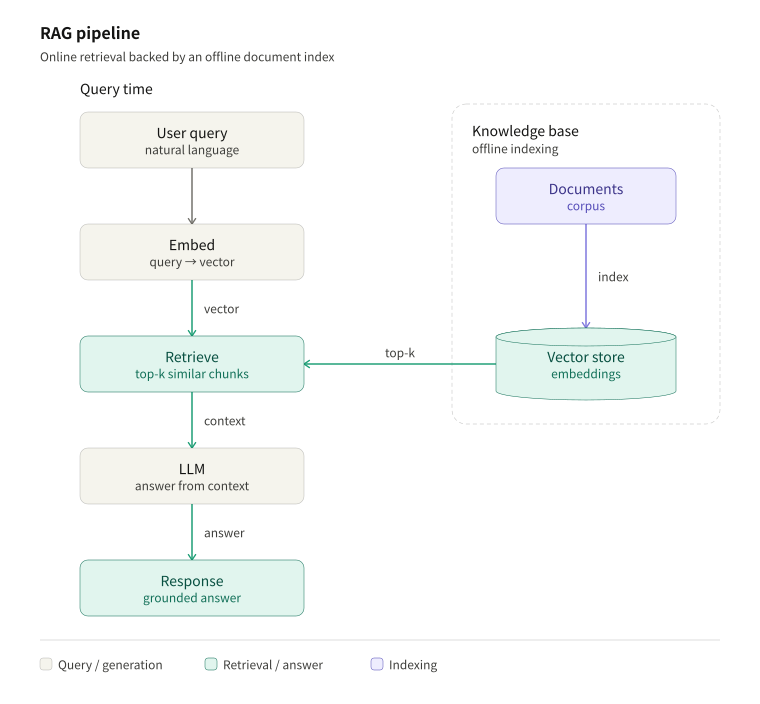
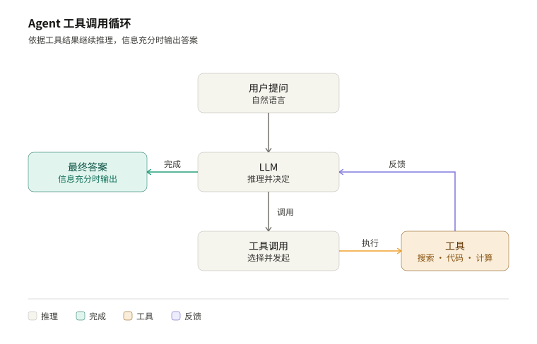

# Visualize

Visualize is an Agent Skill for generating clean technical diagrams as self-contained SVG files. It works with agents that support skills, including Cursor, Codex, Claude Code, and similar tools.

Use it when you want an architecture diagram, flowchart, sequence diagram, memory architecture, data flow, UML-style diagram, comparison matrix, timeline, or another technical visual from a plain-language prompt.





## How To Use

Describe the diagram you want in natural language:

```text
Draw a RAG pipeline diagram.
Draw a Mem0 memory architecture diagram and save it to ~/Desktop/.
Draw a microservice architecture diagram: Client -> API Gateway -> User Service / Order Service -> PostgreSQL + Redis.
```

The agent identifies the diagram type, opens the matching reference from `assets/gallery/<type>.svg`, and writes an SVG in the Visualize house style.

## What It Produces

Visualize writes SVG by default. The SVG is editable, scalable, and can be opened directly in a browser or embedded in documentation.

When Python 3 is available, the skill uses the included `svgkit` helper to size boxes from their text, anchor arrows on box edges, and keep the SVG structure valid. If Python is not available, the agent can still write the SVG directly.

No dependencies are installed by this skill.

## Checked, Not Eyeballed

Layout mistakes are the usual way a generated diagram goes wrong: text clipping its box, an arrow cutting through a node, two boxes overlapping, or an arrow label spilling into the box next to it. Visualize treats those as testable rather than a matter of taste.

`svgkit` writes and validates every file in the same `save()` call. A clean file—or one with warnings only—returns normally. A hard validation failure is machine-detectable: after writing the SVG and printing every problem's details and suggested fix, `save()` raises `svgkit.ValidationError`. The exception carries the complete structured results, and the invalid file remains on disk for inspection.

```text
[svgkit] diagram.svg: self-check found 1 error(s)
  [FAIL] Checking box overlap
         - rect [40,60,160,116] overlaps rect [120,80,240,136]
         Fix: Move overlapping nodes apart; only explicit panels may contain nodes.
```

The same validator runs standalone over any SVG, including several at once:

```bash
python3 visualize/scripts/validate_svg.py -q diagram.svg other.svg
```

`-q` / `--quiet` emits nothing when every file is clean. It prints only warnings and failures otherwise; warnings alone still exit 0, while any hard failure makes the multi-file command exit 1.

Checks cover UTF-8/XML and viewBox structure; non-empty `<title>`/`<desc>` ordering; self-contained assets (only local `#id` or embedded `data:` targets, with external/relative references and `xml-stylesheet` processing instructions rejected) and valid local references; globally unique IDs and exactly one `marker#arrow`, including effective inline/inherited marker styles; an opaque full-viewBox white rect as the first graphics child; flat styling with no gradients, filters, or shadows; shape-aware box containment/overlap; arrow-through-obstacle collisions; canvas overflow; text fit and free-label collisions; type scale, baselines, palette, and the closing tag.

The validator does not silently invent geometry it cannot support. XML/CSS transforms—including individual `translate`, `rotate`, and `scale` properties—skip affected geometry with explicit warnings; a stylesheet transform rule conservatively skips all obstacle/text geometry because selectors are not resolved. `<text>` containing any child/nested run, including a wrapped `<tspan>`, is likewise skipped by text geometry checks. Curved arrows are checked along sampled quadratic/cubic/arc trajectories, not endpoint chords; convex and concave outlines are shape-tested, while ambiguous complex filled-path intersections are warning candidates rather than hard AABB failures. Hidden or fully transparent paint, including zero-alpha `rgba()`/hex colors, does not become an obstacle. `svgkit` emits non-visual `data-role` attributes to distinguish nodes, arrow/legend labels, and intentional panel/container nesting; hand-written SVG can use the same roles.

## Supported Diagram Types

| Type | Use it for |
|---|---|
| Architecture | Services, components, cloud infrastructure, layered systems |
| Data flow | Pipelines with labeled payloads and transformations |
| Flowchart | Decisions, branches, process loops |
| Agent architecture | LLM, tools, memory, planning, output layers |
| Memory architecture | Mem0 or MemGPT-style read and write paths |
| Sequence | Time-ordered requests and responses with lifelines |
| State machine | UML states, transitions, guards, initial and final states |
| Class diagram | UML-style classes with attributes, methods, and relationships |
| Use case | Actors, use cases, include and extend relationships |
| ER diagram | Entities, relationships, and cardinality labels |
| Network topology | Firewalls, switches, DMZs, internal and external zones |
| Comparison | Feature matrices and capability comparisons |
| Mind map | Central concept with curved branches |
| Timeline / Gantt | Phases, milestones, and duration bars |

Every supported type has an owned reference diagram under `assets/gallery/<type>.svg`. See [`references/diagram-gallery.md`](../visualize/references/diagram-gallery.md) for the full index.

The gallery also ships `decision-ladder.svg` — not a separate type, but a compositing-pattern example (a step-by-step allow/deny chain) documented in [`references/layout-patterns.md`](../visualize/references/layout-patterns.md) §3.

## Style

Visualize uses one fixed style: a white canvas, warm cream or tinted boxes, thin open-chevron arrows, flat shapes, no shadows, no gradients, and no remote assets.

Color carries meaning:

| Family | Meaning |
|---|---|
| Neutral | Default boxes and plumbing |
| Green | Primary path, success, retrieval |
| Purple | Alternate or parallel path |
| Terracotta | Warning, limitation, failure |
| Amber | Highlighted or special module |

The exact tokens live in [`references/style.md`](../visualize/references/style.md).

## Repository Map

```text
visualize/
├── SKILL.md                         # Runtime entry point for the agent
├── references/                      # On-demand knowledge files
│   ├── style.md                     # Visual tokens and hard style rules
│   ├── svg-cookbook.md              # svgkit API and SVG snippets
│   ├── svg-layout-best-practices.md # Layout, routing, and spacing rules
│   ├── layout-patterns.md           # Compositing patterns (panels, steps, zones)
│   ├── diagram-types.md             # Per-type layout rules
│   ├── diagram-gallery.md           # Gallery index
│   ├── shape-vocabulary.md          # Color-family-to-meaning mapping
│   ├── product-colors.md            # Optional brand-color lookup
│   └── icons.md                     # Optional pictorial shape snippets
├── scripts/
│   ├── svgkit.py                    # Default zero-dependency SVG helper (self-checks on save)
│   ├── validate_svg.py              # SVG quality validator
│   └── check_palette.py             # Palette drift check (style ↔ svgkit ↔ validator)
└── assets/
    ├── gallery/                     # Reference diagrams by type
    └── samples/                     # Showcase examples
```

## License

MIT
